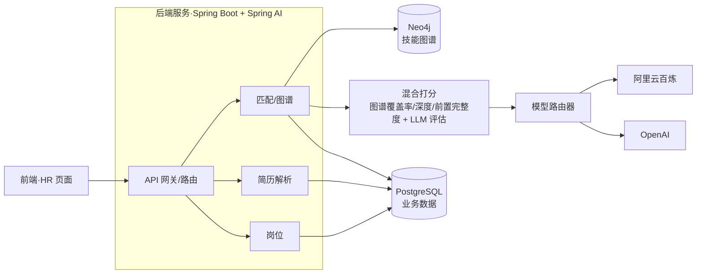
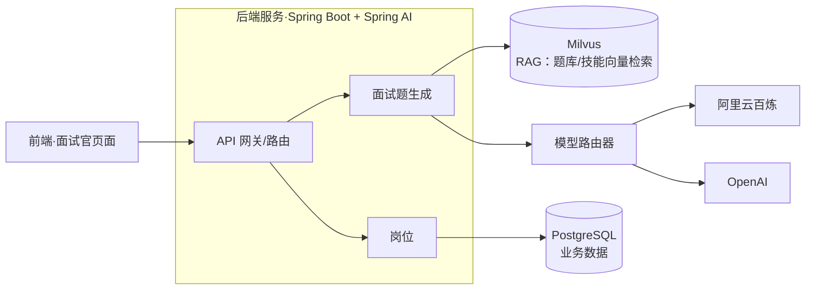

# Smart-HR 智能招聘与面试助手

## 1. 项目简介 🚀
- 面向 HR 与面试官的智能招聘助手，覆盖简历解析、岗位匹配、面试题生成与模型切换。
- 引入 **Neo4j 知识图谱**（预置约 200 个技能节点及依赖关系）作为 HR 匹配的图谱评判依据；
- 引入 **Milvus 向量数据库** 作为 RAG 知识库，分为“企业特定金融知识”与“通用知识”两部分，支撑面试官题库生成与语义检索。
- 采用 **模型适配器模式**，可插拔接入多种大模型（当前支持阿里云百炼、OpenAI）；新增模型只需实现 Adapter 并注册到 ModelRouter。
- 后端基于 Spring Boot + Spring AI，整合 Milvus/Neo4j/PostgreSQL；前端基于 React + Ant Design。

## 2. 技术栈与架构 🧰
- 前端：React 18、TypeScript、Vite、Ant Design、Zustand。
- 后端：Spring Boot 3、Spring Security + JWT、Spring AI。
- 数据与存储：PostgreSQL、Neo4j、Milvus。
- 运维：Docker / Docker Compose。

## 3. 系统架构图 🧭
**HR 流程：简历/岗位 → Neo4j 知识图谱 → 混合打分（图谱评分 + LLM 评估）**


**面试官流程：岗位/技能 → RAG（Milvus 题库/技能向量）→ LLM**


> HR 通过 Neo4j 图谱进行技能匹配后送入 LLM；面试官流程以 Milvus RAG 检索题库/技能语义，再送入 LLM。

## 4. 功能特性 🎯
### HR 🤝
- 岗位管理：岗位创建/编辑/删除，岗位列表。
- 简历处理：上传简历、技能提取、查看简历详情。
- 匹配分析：岗位 ⇄ 简历互相匹配，支持混合打分报告，匹配历史/详情查看。
- 记录管理：匹配结果列表、历史查询。


### 面试官 🎤
- 题目生成：按岗位或技能生成面试题，可选难度与题量。
- 记录管理：生成历史查看、记录删除。


### 通用 🧩
- 认证：登录/注册（JWT），当前用户信息。
- 模型：AI 模型列表与切换（阿里云百炼 / OpenAI，适配器模式）。
- API：Swagger UI。


## 5. 目录结构
- `back/`：Spring Boot 后端。
- `front/`：React 前端。
- `docker/`：基础设施与一键部署的 Compose 文件、初始化脚本。

## 6. 环境准备
- JDK 21、Maven 3.8+。
- Node.js 18+（含 npm）。
- Docker Desktop（含 Docker Compose）。

## 7. 快速开始 ⚡
> 详细步骤请参见 `DEV_GUIDE.md`。

1) 启动基础设施（本地开发）  
```bash
cd docker
docker-compose -f docker-compose.dev.yml up -d
```

2) 初始化 Neo4j 知识图谱  
- 浏览器执行 `docker/neo4j/init.cypher` 和 `docker/neo4j/init-skills-extended.cypher`，或使用 `cypher-shell`（详见 DEV_GUIDE）。

3) 配置大模型 API Key（至少需阿里云百炼，OpenAI 可选）  
```bash
export DASHSCOPE_API_KEY=你的阿里云百炼API_KEY
export OPENAI_API_KEY=你的OpenAI_API_KEY   # 可选
```

4) 启动后端（本地开发）  
```bash
cd back
./mvnw spring-boot:run
```

5) 启动前端（本地开发）  
```bash
cd front
npm install
npm run dev
```

6) 全栈 Docker 一键启动（可选）  
```bash
cd docker
export DASHSCOPE_API_KEY=你的阿里云百炼API_KEY
export OPENAI_API_KEY=你的OpenAI_API_KEY   # 可选
docker-compose up -d
```

- Swagger API 文档：`http://localhost:8080/swagger-ui.html`
- 默认端口：后端 8080，前端 5173（开发）/ 3000（容器），Postgres 15432(dev)/5432(prod compose)，Neo4j 7474/7687，Milvus 19530/9091。

（更多启动、调试与排障说明，请查看 `DEV_GUIDE.md`）

## 8. 开发指南：扩展新的大模型 🛠️
1) 引入 SDK 依赖：在 `back/pom.xml` 添加对应模型的官方 SDK 或 HTTP 客户端依赖，并配置密钥环境变量。  
2) 实现适配器：参考 `AliyunAdapter`，实现 `AIModelAdapter` 接口，封装 `chat` / `embedding` 调用和模型 ID。  
3) 注册模型：在模型注册/路由处（如 `ModelRegistry`、`ModelRouter`）将新 Adapter 注册并开放配置。  
4) 配置密钥：在 `application.yml` 或环境变量中新增该模型的 API Key/Endpoint。  
5) 前端暴露：如需在前端选择模型，补充模型枚举/下拉项即可，无需改后端协议。


## 9. 关于我 👤
- 学历：UNSW IT 硕士 + 西南大学本科。
- 职业：Java 后端程序员。
- 博客：\[代码丰\](https://blog.csdn.net/qq_44716086)。
- 微信号：LQF-dev（随时欢迎骚扰）。

## 10. 许可证 📄
本项目使用 Apache License 2.0

## 🏅 Star History

[](https://www.star-history.com/#LQF-dev/smart-hr&Date)
